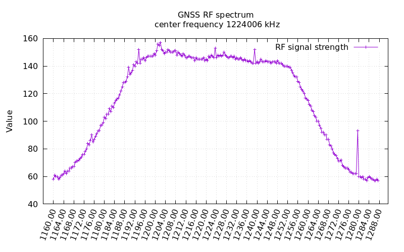
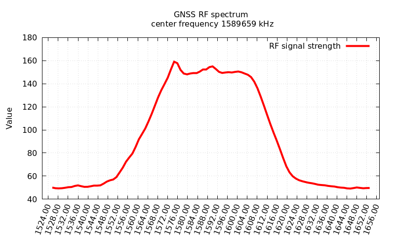

# spectrum analyzer illustrator for an U-blox GNSS receiver

shell script to visualize the output of command MON-SPAN 

Ubuntu and Debian prerequisite packages:  gnuplot, optional gnuplot-x11  

Other prerequisites: 

* a GNSS receiver from U-blox like ZED-F9P
* gpsd package from https://gitlab.com/gpsd/gpsd to run gpsd and ubxtool 

## usage

    spectrum analyzer illustrator for an U-blox GNSS receiver 
      author: gnss.spectrum@ma.yer.at 
      source: https://github.com/hans-mayer/gnssspectrum 
      version: 1.0 - 2025 11 28 
    
    usage: ./gnss_spectrum [ -d DEVICE ] [ -f ] [ -x ] [ -l ] [ -Z 1|0 ] 
        -f 		# generate a file with the result 
        -x		# show the result at X11 server 
        -Z 1|9	# debug  1 ... less, 9 ... more 
        -d DEVICE	# default value: localhost:gpsd:/dev/serial0 
        -l          # smooth funktion

## examples 

### gnss_spectrum -f 

### gnss_spectrum -f -l 

## other documents 

https://content.u-blox.com/sites/default/files/documents/u-blox-F9-HPG-1.13_InterfaceDescription_UBX-21023318.pdf?utm_content=UBX-21023318

## issues 

if command **ubxtool -p MON-SPAN   | sed -n '/UBX-MON-SPAN:/,/^$/p'**  doesn't bring the output like below it will not work.

<pre>
UBX-MON-SPAN:
  version 0 numRfBlocks 2 reserved0 0
   span 128000000 res 500000 center 1589658750 pga 51 res x0 0
      50  50  50  49  49  50  50  49  49  48  49  50  49  48  49  50
      50  50  49  50  55  50  50  50  52  51  50  51  51  51  51  51
      49  52  52  53  52  52  53  54  53  55  52  53  54  55  58  58
      55  56  59  57  57  67  64  65  62  67  64  72  74  71  72  74
      75  79  84  85  89  92  93  94  94  96  97 100 103 106 108 109
     113 115 119 121 125 128 129 132 135 137 138 140 143 143 145 145
     153 158 160 160 161 155 149 148 149 149 149 148 150 147 149 149
     148 148 148 148 150 149 148 149 149 160 149 149 149 151 152 159
     154 155 154 154 151 152 150 149 150 149 150 149 148 149 149 150
     152 150 153 152 155 151 151 152 151 150 149 149 148 149 146 146
     146 144 142 141 138 134 132 129 128 125 120 118 114 112 109 106
     103  99  97  95  91  89  85  83  79  77  75  69  68  66  63  63
      60  59  59  59  58  58  58  56  57  56  55  56  53  55  55  53
      53  54  52  54  52  53  51  52  52  51  52  52  52  51  51  50
      52  49  50  51  52  50  50  50  49  51  51  50  50  50  49  51
      49  50  50  50  51  50  48  49  49  50  50  49  49  51  50  49

</pre>
